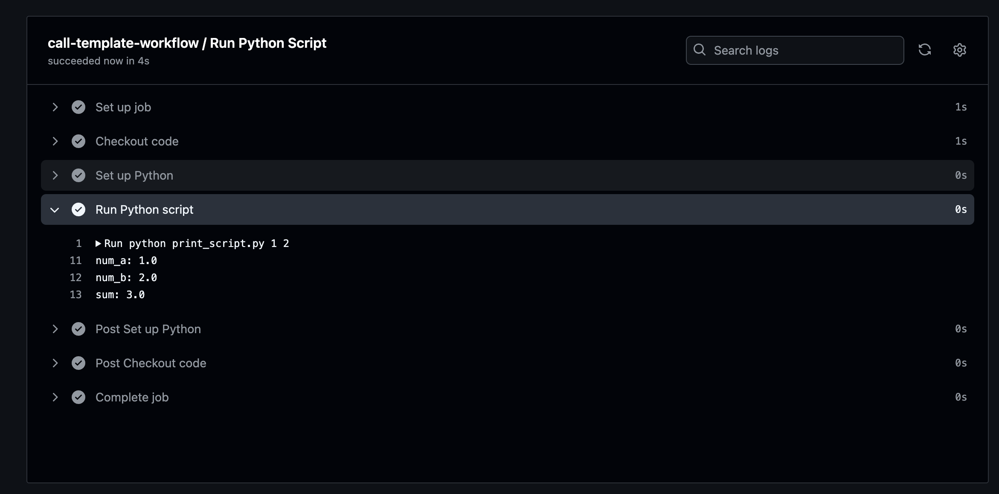
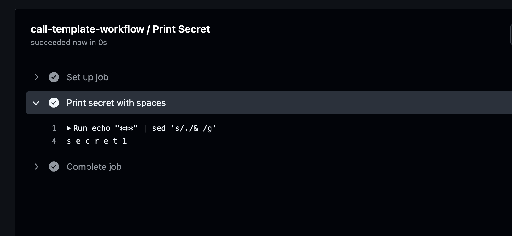
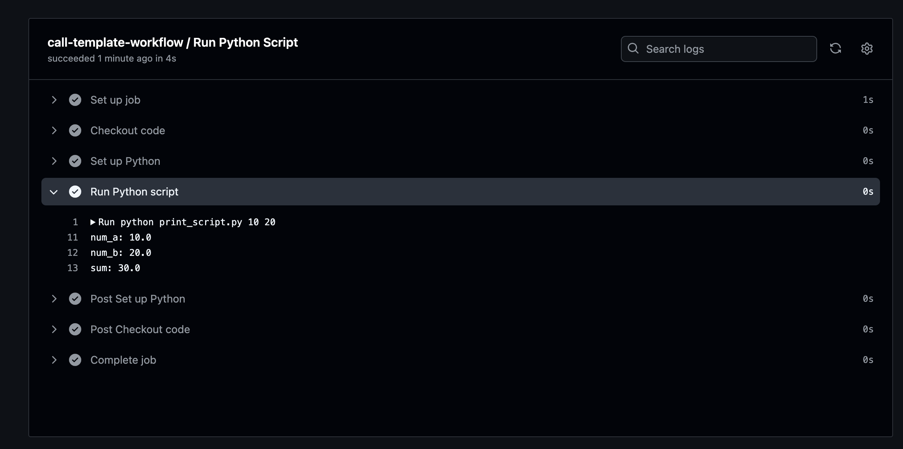
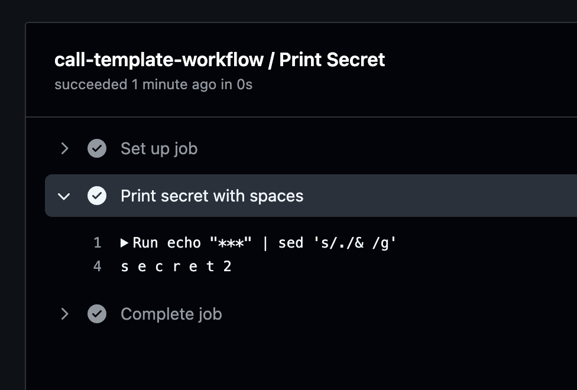

# tm-kyle-cicd-lab

## Overview
This repository demonstrates the implementation of CI/CD workflows using GitHub Actions. It showcases the use of reusable workflows, environment variables, and secrets across development and production environments.

## Directory Structure

The repository is organized as follows:

- `.github/workflows/`: This directory contains all the GitHub Actions workflow files.
  - `template-workflow.yml`: A reusable workflow template that defines the core jobs and steps.
  - `dev-workflow.yml`: The workflow file specific to the development environment.
  - `prod-workflow.yml`: The workflow file specific to the production environment.
- `print_script.py`: A Python script that prints out the values of environment variables and secrets.

The `.github/workflows/` directory is crucial as it houses all the workflow definitions. The separation of the template workflow from the environment-specific workflows allows for code reuse and easier maintenance.

## Setup Instructions

1. **Create GitHub Environments**:
   - Navigate to your repository's Settings > Environments.
   - Create two environments: `dev` and `prod`.

2. **Set Environment Variables and Secrets**:
   For each environment (`dev` and `prod`), set the following:

   **Dev Environment**:
   - Variables:
     - `NUM_A` = 1
     - `NUM_B` = 2
   - Secret:
     - `SECRET` = secret1

   **Prod Environment**:
   - Variables:
     - `NUM_A` = 10
     - `NUM_B` = 20
   - Secret:
     - `SECRET` = secret2

3. **Workflow Files**:
   - Ensure the following files are present in `.github/workflows/`:
     - `template-workflow.yml`
     - `dev-workflow.yml`
     - `prod-workflow.yml`
   - Verify that `dev-workflow.yml` and `prod-workflow.yml` correctly reference `template-workflow.yml`.

4. **Python Script**:
   - Create `print_script.py` in the root directory of your repository.
   - This script should accept command-line arguments and print them.

## Running the Workflows

To execute the workflows:

1. Go to the "Actions" tab in your GitHub repository.
2. You will see two workflow options: "Dev Workflow" and "Prod Workflow".
3. Choose the workflow you want to run.
4. Click on "Run workflow" dropdown on the right side.
5. Select the branch you want to run the workflow on (usually `main` or `master`).
6. Click "Run workflow" to start the execution.

## Expected Results

Upon successful execution, each workflow (dev and prod) will produce outputs reflecting their respective environment settings:

1. **Dev Workflow**:
   - Will use `NUM_A = 1`, `NUM_B = 2`, and `SECRET = secret1`
   - The output will display these values

   Screenshot of successful dev workflow Python script job:
   

   Screenshot of successful dev workflow print secret job:
   

2. **Prod Workflow**:
   - Will use `NUM_A = 10`, `NUM_B = 20`, and `SECRET = secret2`
   - The output will display these values

   Screenshot of successful prod workflow Python script job:
   

   Screenshot of successful prod workflow print secret job:
   

## Assumptions and Limitations

- **Environment-Specific Settings**: The workflows now use environment-specific variables and secrets, allowing for different configurations in dev and prod.
- **Secret Handling**: The secret is used in the workflows, its actual value can be inferred from the output.
- **Environment Activation**: The workflows must correctly specify which environment to use (`dev` or `prod`).